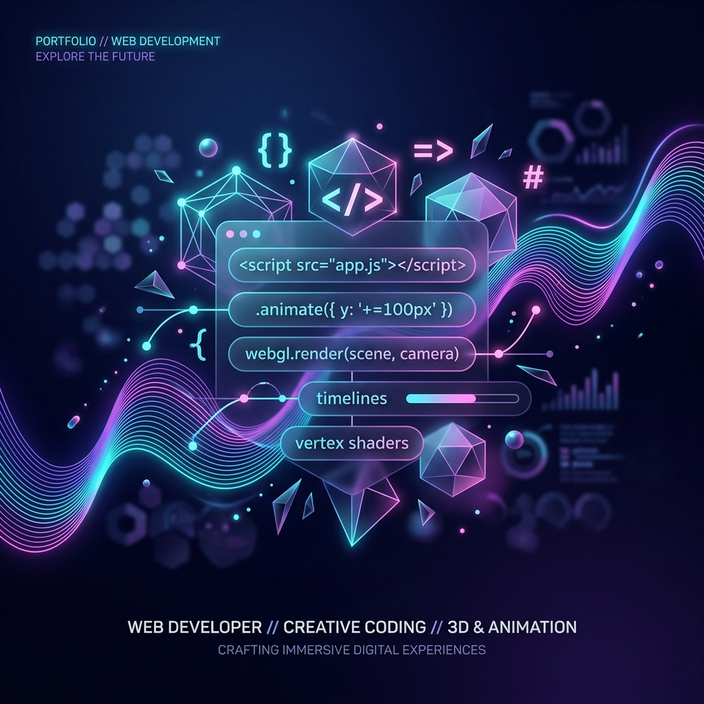

<!--
  PREMIUM GITHUB PROFILE README
  Designed for a Creative Web Developer specializing in 3D Animations & Interactive Scroll Experiences.
  
  👉 HOW TO USE:
  1. Create a public repository named exactly after your GitHub username (e.g., if your username is "johndoe", name the repo "johndoe").
  2. Upload this README.md file and the portfolio_banner.png to that repository.
  3. Replace the placeholder values (like "YOUR_USERNAME", "YOUR_NAME", etc.) with your actual details.
-->

  
  <!-- Premium Generated Banner -->
  

  <!-- Animated Typing Headline -->
  

  

    I build robust, secure, and visually stunning <strong>full-stack web applications</strong>. I bridge the gap between complex backend architectures and high-performance, interactive frontend experiences.
  

  <!-- Quick Social Badges -->
  

    
    
    
  

---

### 🚀 What I Do Best
- **Full Stack Architecture**: Designing end-to-end applications with secure APIs, robust backend logic, and structured data environments.
- **Modern Frontend Engines**: Crafting state-of-the-art interactive user interfaces using **React**, **TypeScript**, and **Tailwind CSS**.
- **WebGL & Creative Touches**: Integrating premium interactive WebGL scenes, product customizers, and fluid animations using **Three.js** and **GSAP**.
- **Performance & Scalability**: Optimizing server performance, API response times, and frontend asset delivery to maintain lightning-fast loading speeds and 60 FPS interfaces.

---

### 🛠️ Creative Tech Stack & Toolkit

  <table>
    <tr>
      <td align="center" width="33%">
        <strong>💻 Frontend Engine</strong>
          
        
         
        
         
        
      </td>
      <td align="center" width="33%">
        <strong>⚙️ Backend Engine</strong>
          
        
      </td>
      <td align="center" width="33%">
        <strong>🚀 DevOps & Creative</strong>
          
        
         
        
         
        
      </td>
    </tr>
  </table>

---

### 🎨 Featured Showcases

  <table border="0">
    <tr>
      <td width="50%" valign="top">
        <h4>🌌 Premium SaaS Analytics Dashboard (Full Stack)</h4>
        
A comprehensive real-time SaaS platform featuring secure authentication, automated metric reporting, and complex data charting.

        

          
          
          
        

        <a href="https://github.com/shubhankarsahu09/saas-analytics-dashboard"><strong>Explore Project →</strong></a>
      </td>
      <td width="50%" valign="top">
        <h4>⚡ Immersive 3D Product Platform (Full Stack)</h4>
        
An interactive product catalog incorporating high-performance 3D WebGL previews, dynamic shopping APIs, and custom GSAP camera transitions.

        

          
          
          
          
        

        <a href="https://github.com/shubhankarsahu09/3d-product-platform"><strong>Explore Project →</strong></a>
      </td>
    </tr>
  </table>

---

### 🛠️ Interactive Workflow: How I Bring Concepts to Life

<b>📐 Phase 1: Architecture Planning & API Design</b>

I outline robust data structures, map out secure API endpoints, define system architectures, and ensure high-level plans account for edge cases and clean routing.

<b>⚙️ Phase 2: Secure Backend Engineering & Core Routing</b>

Building robust server layers using Node.js, integrating secure token authentication, managing data serialization, and optimizing server handling protocols.

<b>🎨 Phase 3: High-Performance Frontend & State Syncing</b>

Creating beautiful and fully responsive UI views in React, establishing solid state managers, integrating real-time frontend hooks, and styling with premium typography and variables.

<b>⚡ Phase 4: Creative WebGL Polish & Performance Tuning</b>

Injecting premium creative touches using GSAP animations and Three.js 3D assets. Optimizing API response payloads, lazy-loading assets, and achieving perfect performance audit scores.

---

   
  

    "Code is like poetry; motion gives it breath."
  

  
  

     
    Based in India • Open to Global Freelance & Remote Collaborations
  

   
  
  <!-- Visitor Count -->
  

